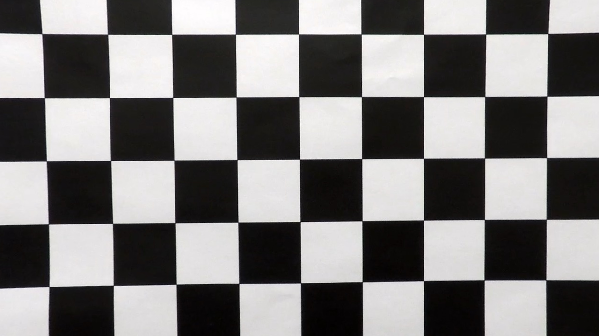
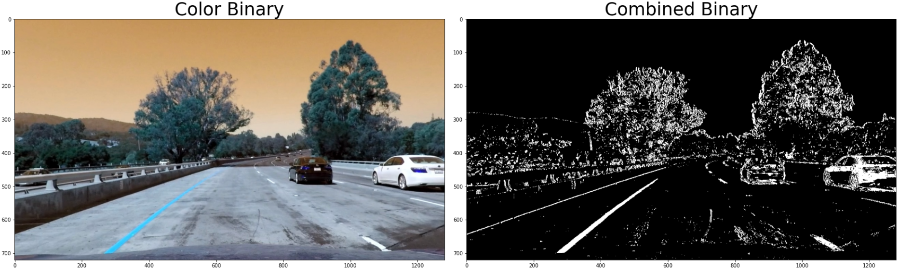
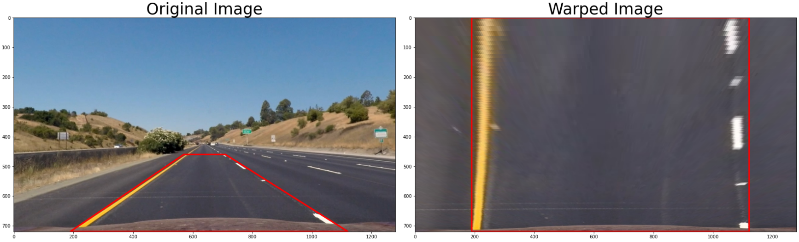
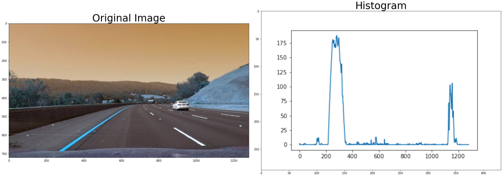
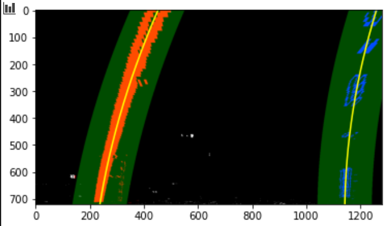
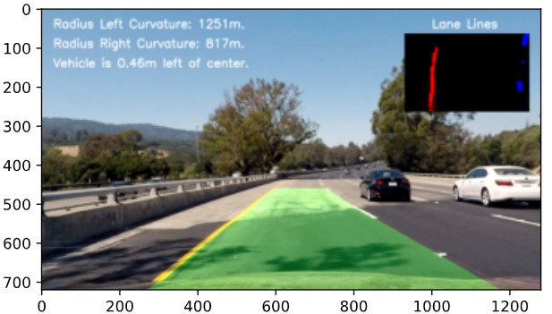

## Advanced Lane Finding

### The goal of this project is to write a software pipeline to identify the lane boundaries in a video from a front-facing camera on a car.
 
![alt text][image1]

---

The goals / steps of this project are the following:

[* Compute the camera calibration matrix and distortion coefficients given a set of chessboard images.](#1-menu)<br>
[* Apply a distortion correction to raw images.](#2-menu)<br>
[* Use color transforms, gradients, etc., to create a thresholded binary image.](#3-menu)<br>
[* Apply a perspective transform to rectify binary image ("birds-eye view").](#4-menu)<br>
[* Detect lane pixels and fit to find the lane boundary.](#5-menu)<br>
[* Determine the curvature of the lane and vehicle position with respect to center.](#6-menu)<br>
[* Warp the detected lane boundaries back onto the original image.](#7-menu)<br>
[* Output visual display of the lane boundaries and numerical estimation of lane curvature and vehicle position.](#8-menu)<br>

[//]: # (Image References)

[image1]: ./output_images/image_result.jpg "Image Result"
[image2]: ./output_images/corners.png "Image Corners"
[image3a]: ./camera_cal/calibration1.jpg "Image Distorted"
[image3b]: ./output_images/calibresult.png "Image Undistorted"

[ximage1]: ./examples/undistort_output.png "Undistorted"
[image2]: ./test_images/test1.jpg "Road Transformed"
[image3]: ./examples/binary_combo_example.jpg "Binary Example"
[image4]: ./examples/warped_straight_lines.jpg "Warp Example"
[image5]: ./examples/color_fit_lines.jpg "Fit Visual"
[image6]: ./examples/example_output.jpg "Output"
[video1]: ./project_video.mp4 "Video"

---

### 1. Camera Calibration <a id="1-menu"></a>

Today’s cheap pinhole cameras introduces a lot of distortion to images. Two major distortions are radial distortion and tangential distortion.

The code that calculates the camera matrix and distortion coefficients can be seen in the [IPython notebook](https://github.com/zenetio/Advanced-Lane-Lines/blob/main/advanced-lane-lines.ipynb), cells from 3 to 5.

In this step, I start by preparing "object points", which will be the (x, y, z) coordinates of the chessboard corners in the world. Here I am assuming the chessboard is fixed on the (x, y) plane at z=0, such that the object points are the same for each calibration image.  Thus, `objp` is just a replicated array of coordinates, and `objpoints` will be appended with a copy of it every time I successfully detect all chessboard corners in a test image.  `imgpoints` will be appended with the (x, y) pixel position of each of the corners in the image plane with each successful chessboard detection. I then used the output `objpoints` and `imgpoints` to compute the camera calibration and distortion coefficients using the `cv2.calibrateCamera()` function.<br>
The parameters are calculated just once and then saved to disk. In the next steps the parameters are loaded for use.

![alt text][image2]

### Pipeline (single images)

Once we have the camera parameters, we can build a pipeline to process single images, described in the next steps. In cell 6, I wrote a set of APIs that are used in this project.

### 2. Distortion correction. <a id="2-menu"></a>

In this step, I describe how I apply the distortion correction to one of the test images. The code for this step in in cells 6 and 8 where the code calls the `cv2.undistort()` function and obtained this result:

<p align="center">
---------->> Original Image >>----------------->> Undistorted Image >>---------<br>

<br>
</p>

```python
# Apply distortion correction
img = cv2.imread(images[0])
fname = os.path.basename(images[0])

dst = undistort(img,mtx,dist)
# save undistort
cv2.imwrite('output_images/calibresult.png',dst)
# plot images
plot_before_after(fname, img, "Original Image", dst, "Undistorted Image")
```

### 3. Thresholded Binary Image <a id="3-menu"></a>

In order to find the lane lines, is better to convert the color image to binary image (gray), where we have only the white lines that describe the image scenario. But this step is not so simple, as we have a lot of different options to convert a color image to binary image. 
In the IPython Notebook, I show 4 different ways to convert a color image to binary image, using the functions: `grayscale()`, `cv2.adaptiveThreshold()` and `color_gradient()`. The code is showed from cell 10 to 14. The below code is from cell 14.

```python
# use the Sobel algorithm
color_binary, combined_binary = color_gradient(udst)
# save image
cv2.imwrite('./output_images/' + name + '_binary5.png',combined_binary)
# Plot test image
plot_before_after(fname, udst, "Color Binary", combined_binary, "Combined Binary", True)
```

<p align="center">
<br>
</p>

When we check all four image outputs, we can see that the best result is using the **Sobel** algorithm. So, I decided to use this approach to produce the binary image.

### 4. Perspective Transform<a id="4-menu"></a>

The code for my perspective transform includes a function called `warper()`, which appears in code cell 6 of IPython Notebook.  The `warper()` function takes as inputs an image (`img`), as well as source (`src`) and destination (`dst`) points.  I chose the hardcode the source and destination points in the following manner:

```python
src = np.float32(
    [[w-160, h],                # lower right
    [160, h],                   # lower left
    [(w/2)-70, (h/2)+100],      # upper left
    [(w/2)+70, (h/2)+100]])     # upper right
dst = np.float32(
    [[w-160, h],                # lower right
    [160, h],                   # lower left
    [160, 0],                   # upper left
    [w-160, 0]])                # upper right
```

This snippet code is showed in code cell 16 of IPython Notebook.

This resulted in the following source and destination points:

| Source        | Destination   |
|:-------------:|:-------------:|
| 1120, 720     | 1120, 720     |
| 160, 720      | 160, 720      |
| 570, 460      | 160, 0        |
| 710, 460      | 1120, 0       |

I verified that my perspective transform was working as expected by drawing the `src` and `dst` points onto a test image and its warped counterpart to verify that the lines appear parallel in the warped image.

<p align="center">
<br>
</p>

#### 5. Detect Lane-Line Pixels.<a id="5-menu"></a>

In this step, because we are working with the lane-lines, I defined a `Line()` class to encapsulate all the stuffs relate to lane-line, which facilitates to manage all the stuffs relate to the line in the road. The code of `Line()` class is located in code cell 19 of the IPython Notebook.<br>
In this step, firtly we need identify where in the road is the lane-line. This can be done by plotting the histogram of pixel distribution of the image. The figure below shows what we get.

<p align="center">
<br>
</p>

The code below is used to generate the histogram and it can be seen in code cell 23 of IPYthon Notebook.

```python
# Create histogram of image binary activations
histogram = hist(bin_warped)
# save to disk
filesaved = './output_images/' + name + '_hist.png'
# Visualize the resulting histogram
plt.plot(histogram)
plt.savefig(filesaved)
```

Note that the histogram shows where the distribution is higher, which means that the presence of lane-lines.
Then I identified the lane-line pixels and fit their positions with a polynomial equation of type `f(y) = A*y**2 + B*y + C`, where this equation is valid for both right and left lines.

Then I did some other stuff and fit my lane lines with a 2nd order polynomial kinda like this:

![alt text][image5]

### 6. Radius of Curvature and Car Position.<a id="6-menu"></a>

The next step is the radius calculation of curvature of the lane and the position of the vehicle with respect to center.The code is located in cells from 25 to 29 in IPython Notebook.<br>
The image below show the result after cadius calculation.

<p align="center">
<br>
</p>

### 7. Combine the Warpped lane boundaries back onto the original image.<a id="7-menu"></a>

Finally, in this step I combined the warped lane boundaries back onto the original image. The resulting image shows where the car should move in the road.<br>
The snippet code for this step can be seen below and it is located in cell 31 of IPython Notebook.

```python
image = mpimg.imread(images[3])
img = np.copy(image)
left_line  = Line()
right_line = Line()
img_result = process_image(img)
plt.imshow(img_result)
plt.show()
```

Note that the code shows that two objects of type `Line()` are instantiated and used to manage all the stuffs related to each lane-line.<br>
The resulting image can be seen below:

<p align="center">
<br>
</p>

---

### Pipeline (video)

The pipeline - Putting all Together

### 8. Show the results processing a video.<a id="8-menu"></a>

In this final step, we can put all we have done until now together and create a pipeline to process all the frames of a video, simulating what an UAV system does when an autonomous car is moving in the road.<br>
The pipeline code that process the video is provided in cell 28 of the IPython Notebook.
The resulting video can be seen [here](https://youtu.be/M1srFI8ax3E) or [here](https://github.com/zenetio/Advanced-Lane-Lines/blob/main/project_video_processed-00.mp4).

---

### Discussion

- This is not a difficult project but, by the other side, it takes a long time because there are a bunch of details that must be take in account to get success.
- This project has a big range, from camera calibration, passing to image processing and working with polynomial equations. So, we can learn a lot of things working on this project.
- The sequence is very important and, devide in steps will help to go back and find issues when things are not working well.
- If we make all the things correct in the steps, when we reach the video pipeline, it will work fine without the need to go back and fix issues. Well, that was my case :-)
- I might improve it if I were going to pursue this project further.  
